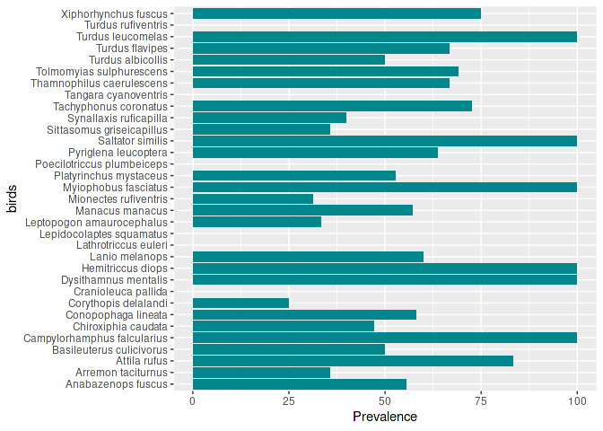
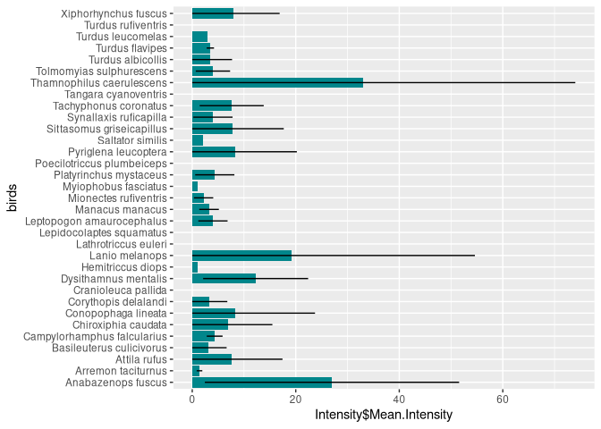

<!-- README.md is generated from README.Rmd. Please edit that file -->

# ecopaR - an R package for parasite ecology

<!-- badges: start -->
<!-- badges: end -->

## Installation

You can install and attach the development version of ecopaR like so:

``` r
if(!require(devtools)){
    install.packages("devtools")
}

if(!require(ecopaR)){
    devtools::install_github("ralphmp/ecopaR")
}

library(ecopaR)
```

### Linux users need to install the following packages before installing devtools (Debian examples): libcurl4-openssl-dev libssl-dev libfontconfig1-dev libxml2-dev libharfbuzz-dev libfribidi-dev libfreetype6-dev libpng-dev libtiff5-dev libjpeg-dev

## Examples:

### birdticks data:

``` r

attach(birdticks)
str(birdticks)
#> 'data.frame':    589 obs. of  2 variables:
#>  $ birds: chr  "Conopophaga lineata" "Chiroxiphia caudata" "Chiroxiphia caudata" "Chiroxiphia caudata" ...
#>  $ ticks: int  1 1 0 0 0 0 0 0 0 0 ...
head(birdticks)
#>                       birds ticks
#> 1       Conopophaga lineata     1
#> 2       Chiroxiphia caudata     1
#> 3       Chiroxiphia caudata     0
#> 4       Chiroxiphia caudata     0
#> 5 Sittasomus griseicapillus     0
#> 6    Synallaxis ruficapilla     0
```

### Basic functions:

``` r

prevalence(ticks)
#> [1] 51.104
abundance(ticks)
#>   Mean.Abundance Standard.Deviation CI.Lower CI.Upper
#> 1          4.054             11.492    3.126    4.982
intensity(ticks)
#>   Mean.Intensity Standard.Deviation CI.Lower CI.Upper
#> 1          7.934             15.098    3.126    4.982
```

### Aggregation indexes:

``` r

var_mean(ticks)
#> [1] 32.572
k_negative_binomial(ticks)
#>         k 
#> 0.2369274
k_negative_binomial_inverse(ticks)
#>      1/k 
#> 4.220701
discrepancy(ticks)
#> [1] 0.813
```

##### Please, see note about k_negative_binomial functions before use.

### Combining with R functions:

``` r

birdticks %>% 
  group_by(birds) %>% 
    summarise(
      Prevalence = prevalence(ticks)[1],
      Abundance = abundance(ticks)[1],
      Intensity = intensity(ticks)[1]) %>% 
      head()
#> # A tibble: 6 × 4
#>   birds                 Prevalence Abundance$Mean.Abund…¹ Intensity$Mean.Inten…²
#>   <chr>                      <dbl>                  <dbl>                  <dbl>
#> 1 Anabazenops fuscus          55.6                  15                     27   
#> 2 Arremon taciturnus          35.7                   0.5                    1.4 
#> 3 Attila rufus                83.3                   6.33                   7.6 
#> 4 Basileuterus culiciv…       50                     1.57                   3.14
#> 5 Campylorhamphus falc…      100                     4.33                   4.33
#> 6 Chiroxiphia caudata         47.1                   3.29                   7   
#> # ℹ abbreviated names: ¹​Abundance$Mean.Abundance, ²​Intensity$Mean.Intensity
```

Prevalence graph:

``` r

birdticks %>% 
  group_by(birds) %>% 
  summarise(
    Prevalence = prevalence(ticks)[1]) -> gg

graph <- ggplot(gg, aes(x = birds, y = Prevalence)) + geom_bar(stat = "identity", fill="turquoise4")
graph + coord_flip()
```



Intensity graph:

``` r

birdticks %>% 
  group_by(birds) %>% 
  summarise(
    Intensity = intensity(ticks)[1],
    Standard_Deviation = intensity(ticks)[2]) -> gg

graph <- ggplot(gg, aes(x = birds, y = Intensity$Mean.Intensity)) + geom_bar(stat = "identity", fill = "turquoise4" , position=position_dodge()) +
geom_errorbar(aes(ymin = ifelse(Intensity$Mean.Intensity - Standard_Deviation$Standard.Deviation < 0, 0, Intensity$Mean.Intensity - Standard_Deviation$Standard.Deviation), ymax = Intensity$Mean.Intensity + Standard_Deviation$Standard.Deviation), width = 0, position=position_dodge(.9))

graph + scale_fill_brewer(palette="Dark2") + coord_flip() 
```



### Hydric stress functions:

``` r

saturation_deficit(80, 25)
#> [1] 4.55717

saturation_deficit_bulb(wet_bulb = 22, dry_bulb = 26)
#> [1] 7.746946
```
